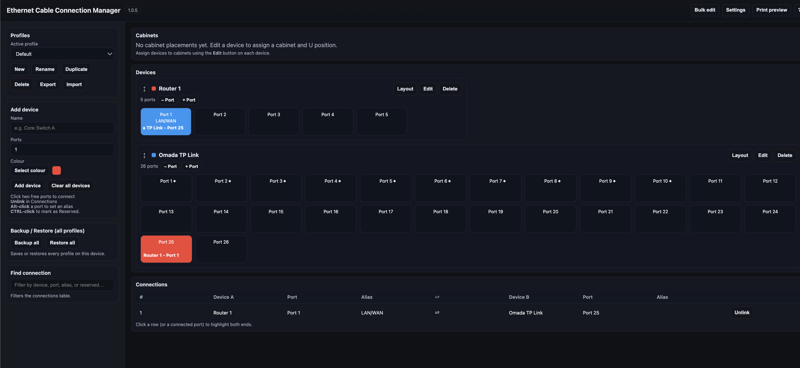

# ECCM — Ethernet Cable Connection Manager

> A single HTML file that turns cable chaos into a clean, searchable map of every physical connection in your network.

**No installation. No server. No account.** Download `eccm.html`, open it in a browser, and start documenting.

---

## Quick start

1. [Download `eccm.html`](https://github.com/I7smile/ECCM/releases/latest/download/eccm.html)
2. Open it in any modern browser (Chrome, Firefox, Safari, Edge)
3. Add a device → click two ports → connection recorded

That's it.

---

## What it does

ECCM gives you a visual port map of every device in your network — switches, patch panels, servers, firewalls — and tracks exactly which physical cable goes where.

### Features at a glance

| Feature | Description |
|---|---|
| **Device management** | Add any device with a configurable port count (1–512+) |
| **Visual port grid** | Ports shown as a labelled grid; connected ports coloured by peer device |
| **One-click connections** | Click port A, click port B — link created |
| **Port metadata** | Speed (100M–100G), VLAN IDs, alias labels, reserved status |
| **Auto speed negotiation** | Sets link speed to the lower of both devices' max speeds |
| **Bulk editing** | Select multiple ports and set speed, VLANs, or reserved status in one action |
| **Cabinet / rack view** | Assign devices to named cabinets with U-position; visualise rack layout |
| **Connections table** | Searchable table of every link; click a row to highlight both ends |
| **Multiple profiles** | Save completely separate network maps as named profiles |
| **Import / export** | Share a single profile as JSON; back up all profiles at once |
| **Print / PDF export** | Clean printable sheet with port diagrams and connections table |
| **Dark & light theme** | Switch in Settings |
| **Keyboard accessible** | Full keyboard navigation; press `?` for a shortcut reference |

---

## How to use

### Adding a device

Fill in **Name**, **Ports**, and optionally a **colour** in the sidebar, then click **Add device**. The device appears in the main canvas as a grid of numbered ports.

Use the **Edit** button on a device to set:
- Cabinet name and rack U-position (for the rack diagram)
- Maximum port speed (used for auto-negotiation)
- Port layout options (row/column order, full-width, dual-link mode)

### Connecting ports

1. Click a free port — it highlights with a white ring
2. Click another free port on any device
3. Confirm the prompt → link created, both ports coloured by the peer device

Click a connected port to jump to its row in the Connections table.

### Port options (right-click or ⋮ icon)

Right-click any port (or click the **⋮** that appears on hover) to open the port menu:

- Set link speed
- Set VLAN IDs (comma-separated, e.g. `10, 20, 100`)
- Set an alias label
- Set a "Linked to" override label
- Mark as Reserved

### Keyboard shortcuts

| Key / action | What it does |
|---|---|
| Click a free port | Select as first connection end |
| Click another free port | Confirm and create the link |
| **Alt + click** a port | Set / edit port alias |
| **Ctrl + click** a port | Mark port as Reserved |
| **Right-click** a port (or ⋮) | Open speed & VLAN menu |
| Click a connections row | Highlight both port ends |
| **Escape** | Close modal / cancel selection |
| **?** | Open shortcuts reference |

### Bulk editing

Click **Bulk edit** in the top bar, then click any number of ports to select them (they highlight in yellow). Use the toolbar that appears to:

- **Set / Add / Remove / Clear** VLAN IDs across all selected ports
- **Set / Clear** link speed across all selected ports
- **Mark / Clear** reserved status

### Profiles

Use the **Profiles** card in the sidebar to:

- Create named profiles (e.g. one per site or per customer)
- Switch between profiles instantly
- Rename, duplicate, or delete profiles
- **Export** a single profile as JSON
- **Import** a previously exported profile
- **Backup all** profiles to one JSON file
- **Restore all** from a backup

### Print / export

Click **Print preview** to open a formatted sheet with:
- Rack diagrams (if cabinets are configured)
- Port grid for every device
- Full connections table with speeds, VLANs, and reserved ports

Use your browser's **Print → Save as PDF** to create a shareable document.

---

## Data storage

All data is saved automatically to your **browser's localStorage** — nothing is sent to any server. Data persists between sessions as long as you use the same browser on the same machine.

To keep a permanent backup, use **Backup all profiles** in the sidebar regularly and store the JSON file somewhere safe.

> **Tip:** If you need to move your data to another machine or browser, use **Export profile** or **Backup all**.

---

## Browser support

| Browser | Support |
|---|---|
| Chrome / Edge (modern) | ✅ Full support |
| Firefox (modern) | ✅ Full support |
| Safari (modern) | ✅ Full support |
| Mobile browsers | ⚠️ Functional but optimised for desktop |

---

## Contributing

Contributions are welcome. Please open an issue first to discuss larger changes.

1. Fork the repo
2. Edit `eccm.html` directly — the entire app lives in that one file
3. Test in at least one modern browser
4. Open a pull request with a clear description of the change

See [CONTRIBUTING.md](CONTRIBUTING.md) for full guidelines.

---

## Changelog

See [CHANGELOG.md](CHANGELOG.md).

---

## License

MIT — see [LICENSE](LICENSE).
